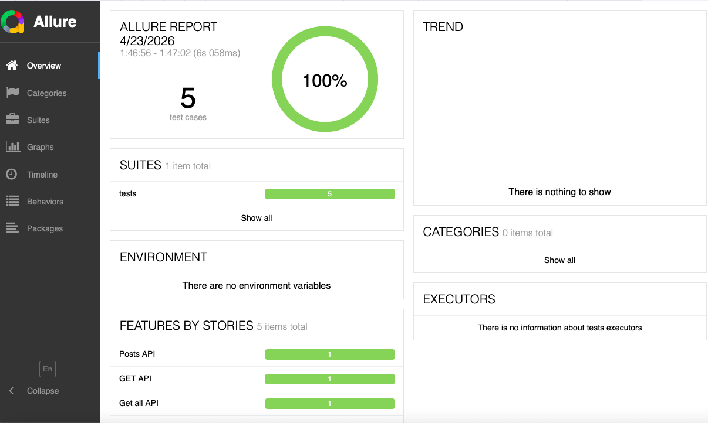

# API Autotests

## Стек
- Python 3.10
- pytest
- requests
- pydantic
- allure
- pytest-xdist

## Структура проекта
```
api_tests/
├── .github/workflows/autotests.yml
├── clients/
│   └── api_client.py
    └── post_api.py
├── models/
│   └── entity.py
├── tests/
│   └── test_api.py
├── config.py
├── conftest.py
├── requirements.txt
└── README.md
```

## Установка

```bash
python3.10 -m venv venv
source venv/bin/activate
pip install -r requirements.txt
```

## Запуск тестов

```bash
# Обычный запуск
pytest -v

# Параллельный запуск
pytest -n auto -v

# С генерацией Allure отчёта
pytest --alluredir=allure-results
allure serve allure-results
```

В проекте использовались:
- Python requests
- Библиотека для сериализации/десериализации pydantic
- Тестовый фреймворк pytest

## CI/CD
Тесты запускаются автоматически через GitHub Actions при push в `develop`
и при открытии Pull Request в `main`.

## Allure Report


